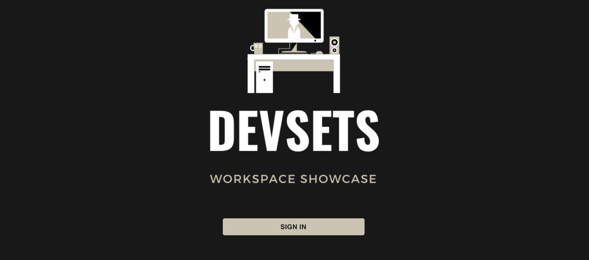
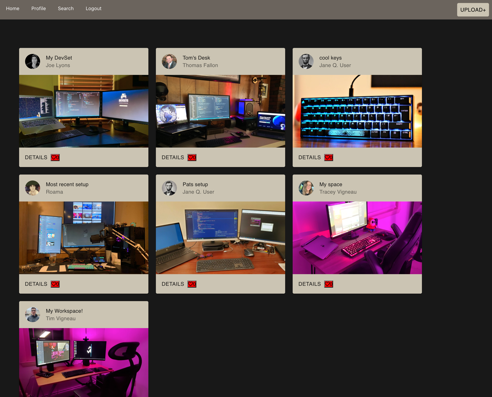
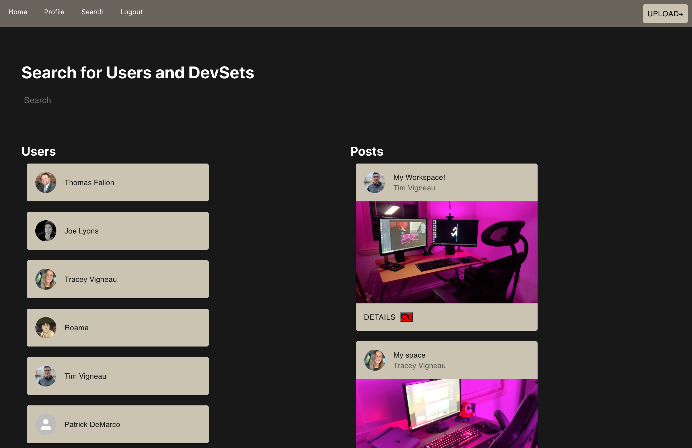

# ***<h1 align="center">DevSets</h1>***

# <h1 align='center'> [Visit DevSets!](https://devsets-d95a1.web.app/)
</h1>

## Table of Contents

* [Purpose](#Purpose)

* [Features](#Features)

* [Instructions](#Instructions)

* [Technologies](#Technologies)

* [Contributors](#Contributors)

* [License](#License)

## Purpose

The pandemic required many workers to shift from having their own workspace at an office to their home. In that time, many people upgraded and reinvented their setups. DevSets allows users to showcase their workspaces, post pictures and details of your workspace! Not using your set up for work? Showcase your PC gaming builds, specs and/or useful tips that helped you perfect your perfect setup. 

Want to showcase a little more than just what you work on? Showcase a personal Github repository and peek the interest of others with your projects. Share, collaborate and explore it all on DevSets. 

## Features 

* A secure login system backed and powered by Firebase. 
* Google Authentication.
* Persisted user crendentials across all pages and platforms.
* Uploading only allowed when logged in with an account to prevent miscellaneous posts.
* Easy to use interface. 
* Searchable database by DevSet post title or user. 

## Instructions

1. Navigate to the webpage. 
2. Login with a Google Account
3. Create your first post on DevSets! 

Note: Profile images will default to Google Account profile image but feel free to upload your own and show off your personality. 

## Technologies

* [React](https://reactjs.org/)
* [Nodejs](https://nodejs.org/en/)
* [Expressjs](https://expressjs.com/)
* [Firebase](https://firebase.google.com/)
* [Material-UI](https://material-ui.com/)
* [MongoDB](https://www.mongodb.com/)
* [Mongoose](https://mongoosejs.com/docs/)
* [Multer](https://www.npmjs.com/package/multer)

## Contributors
* [Tim Vigneau](https://github.com/tjvig94)
* [Chad Courtney](https://github.com/chadcourtney9)
* [Tom Fallon](https://github.com/TomFallon9)
* [Patrick DeMarco](https://github.com/pfdemarco)
* [Joe Lyons](https://github.com/Josephjlyons)

## Licencse

MIT License

Copyright (c) [2021] 

Permission is hereby granted, free of charge, to any person obtaining a copy
of this software and associated documentation files (the "Software"), to deal
in the Software without restriction, including without limitation the rights
to use, copy, modify, merge, publish, distribute, sublicense, and/or sell
copies of the Software, and to permit persons to whom the Software is
furnished to do so, subject to the following conditions:

The above copyright notice and this permission notice shall be included in all
copies or substantial portions of the Software.

THE SOFTWARE IS PROVIDED "AS IS", WITHOUT WARRANTY OF ANY KIND, EXPRESS OR
IMPLIED, INCLUDING BUT NOT LIMITED TO THE WARRANTIES OF MERCHANTABILITY,
FITNESS FOR A PARTICULAR PURPOSE AND NONINFRINGEMENT. IN NO EVENT SHALL THE
AUTHORS OR COPYRIGHT HOLDERS BE LIABLE FOR ANY CLAIM, DAMAGES OR OTHER
LIABILITY, WHETHER IN AN ACTION OF CONTRACT, TORT OR OTHERWISE, ARISING FROM,
OUT OF OR IN CONNECTION WITH THE SOFTWARE OR THE USE OR OTHER DEALINGS IN THE
SOFTWARE.